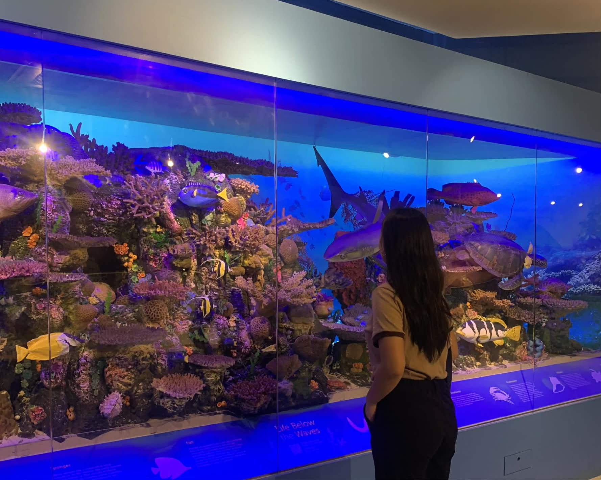

---

## 🧠 About Me

💡 I am a **Computer Science student** and **Administrative Officer at Devthugs** with experience in project coordination, documentation, research, pitching, and system development support.

---

## 💼 Current Role

### Administrative Officer — Devthugs

I support the team through:

* Project coordination
* Documentation and file organization
* Team communication
* Task tracking and preparation
* Project planning support
* System development assistance

---

## 🛠️ Tech Stack
- Laravel
- React
- PHP
- JavaScript
- TypeScript
- PostgreSQL
- HTML & CSS
- UI/UX Design
- Web Development

## 🧰 Tools & Development Environment
- Git & GitHub
- Laragon
- VS Code
- Postman
  
## 🏆 Achievements

🥈 **2nd Place** — Startup Competition, Agriculture Category

🥉 **3rd Place** — National Innovation Day in Caraga, DOST Regional Pitch Fest

🥉 **3rd Place** — Startup & Innovation Congress 2026

🏅 **Top 10** — AgriSenso Innovation

🎖 **Certificate of Appreciation** — AI Ready ASEAN Youth Challenge 2026

---

## 📌 Featured Projects

### 🎓 IskolarLink

A digital scholarship application system that helps students submit, track, and manage scholarship applications online.

---
### 🎮 Bangsak 

A a two-player digital adaptation of the traditional Filipino game that transforms its core concepts into an interactive virtual experience. The game features competitive gameplay in which two players assume opposing roles and engage in strategic actions based on the original mechanics of Bangsak.

---
🚀 Project Involvement
🌱 AgriSenso — Pitching Project

Served as a Researcher and Product Specialist. Helped prepare research, product details, and pitch materials. Presented the project at the provincial level and qualified for the regional level.

🚢 AIMPORT — Pitching Project

Served as a Researcher and Product Specialist. Prepared and presented the project concept, target market, business value, and potential impact. Helped develop the marketing and business direction of the project.

🤖 RobotX Studio — AI Ready ASEAN Youth Challenge 2026

Served as a Researcher and Product Specialist. Assisted in project content, research, and product preparation. Completed the AI Ready ASEAN Youth Challenge 2026 and received a Certificate of Appreciation.

### 🏢 Devthugs Platform

A company-related platform where I support documentation, coordination, planning, and web experience improvement.

---

## 📫 Connect With Me

📧: shanedelavegaonsing05@gmail.com
---

### “Building organized and meaningful digital solutions with Devthugs.”
